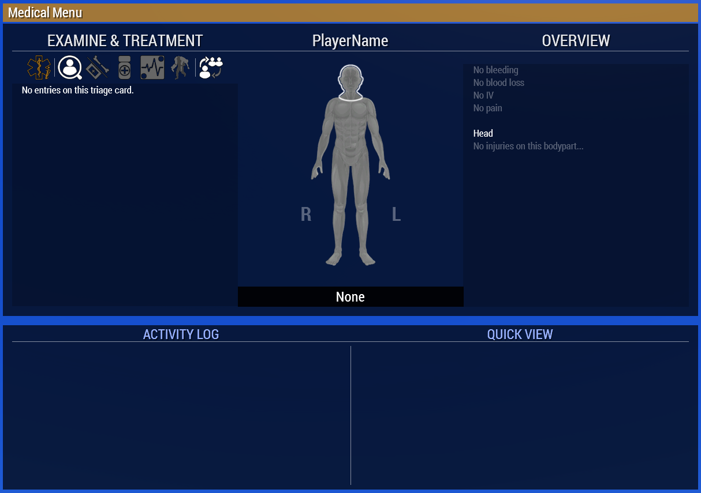

# Basic ACE Medical
This guide is aimed primarily towards players who have not used ACE Medical previously, but also covers more general topics that helps anyone become a more effective part of the squad.

## ACE Medical

ACE Medical is part of the ACE mod, which aims to increase the realism of ArmA 3 Gameplay.

ACE Medical extends the vanilla ArmA 3 health model and adds several additional factors, such as different types of wounds, bleeding, heart rate, blood pressure, and so on. On top of this there are also an extended arsenal of treatments available to the player, and knowing which one to choose in what circumstances is part of the fun.

Lets begin.

## What to expect
  ACE Medical is quite advance, and may be a little bit overwhelming at first, but it really comes down to a rather simple gameloop.

  `Damage -> Wounds -> Secondary Effects -> Treatment`

  Compared to vanilla ArmA 3 only the `wounds` are really new, however its worth noting that all other parts have been heavily extended as well.

  We will go over each stage briefly.

### Damage
  _Sources of damage determine wound types_
  
### Wounds
  There are many different types of wounds simulated in ACE Medical, from scraped knees to large velocity wounds. When damage is taken ACE determines the types, sizes, and ammounts of wounds to apply to the player based on the type of damage. For now all you really need to know is that some wounds are bigger than other, and therefore will require more urgent attention. If you are hit in the arm with a .50 cal you might want to take care of that much sooner than if you take a 9mm to your chestplate. 

### Secondary Effects
  Wounds in turn will cause seconday effects on the player.
  
  This is where the health model comes into play. While vanilla ArmA 3 models health closer to a common HP system where a single number represents the health of the unit, ACE instead models parameters such as heartrate, bloodpressure, and pain. These are all interlinked with eachother and in turn affect the overall state of the players health, such as unconciosness, stamina, accuracy, and even vision.

  These seconday and tertiary effects are the result of taking damage, and the goal of the ACE Medical gameplay loop is to revert these effects and "Heal" the unit.

### Treatments
  Treatments in vanilla ArmA 3 is mostly a one-and-done thing, what with FAKs and Medkits. In ACE Medical this is much, much more neuanced and the core gameplay of the system.

  Each wound and effect are best treated by a specific treatment option, and more often than not the treatments come with both pros and cons, so choosing the correct one can make a huge difference. For non-medics however there is room for some amount of generalisation to make it easier.

  Treatments can be broken down into three categories  

  - Bandages
  - Medications
  - Specialized

  **Bandages** are the most straight forward. You apply a bandage to a wound to stop it from bleeding. There are however several different types of bandages to choose from but we will cover which you need to care about later.

  **Medications** are a little bit more tricky. This category mainly refers to `Morphine` and `Epinephrine`. These affect not the wounds but rather target the secondary effects by altering the vital parameters. We will cover how to use them and what to be carefull of later, but for now just remember that you want to be carefull with these.

  The **Specialized** category include items such as `Tourniqets`, `Splints`, and `IVs`. These items are designed to do a single task, and are pretty straight forward. We will discuss the workings of these later as well. There are more specialized items available, but as a non medic these three are the ones you need to care about.

## Interacting with ACE Medical
_How to interact with ACE Medical as a player_
### How to Access
  EXPLANATION TEXT
  

### How to Navigate
### How to Read

## Evaluating damage
_How to efficiently triage casualties_
  Here we will cover what to do and what to look for when you've just arrived to help a wounded player, or indeed when you yourself have taken damage.
### Is the patient alive
  This can sometimes be tricky to tell, since the unconcious state can appear very similar to the dead state. Heartrate cannot be relied on to distinguish between these states since it can be non-existent in both states.
  The easiest way to tell if a patient is dead, and therefore beyond saving, is to look at their character model. If they are ragdolled they are dead. If they are in a wounded animation they are still alive.
### Is the patient conscious
  Firstly, determine if the player is concious. This is very easy, if they are moving around and talking, they are concious. If they are in any of the unconcious animations, they are not.
  A concious players need for medical attention is less immediate.
### How hurt is the patient
  When first opening the ACE Medical menu i like to get a quick overview of roughly how bad the patients wounds are by simply looking at the colors on the player chart. Some blue and light yellow parts are to be expected but often not immedieatly lifethreatening. Alow of yellow or red parts however moves the timetable up quite a bit.
### Does the patient have vitals
  When we have a rough idea of the overall state of the patient, we will check their vitals. This can be done by selecting a limb that is not tourniqueted, and checking for their blood pressure or heartrate.
  I usually only check the bloodpressure, since no bloodpressure will also mean that there is no heartrate. Any bloodpressure will tell you both that there is heart activity, and also how their bloodlevels are doing.

  When a player looses their hearbeat, ACE will start a timer, when that timer runs out the player dies. This is why its important to check the vitals early in the evaluation stage so that the timer does not run out while we are fixing other stuff.
  The length of this timer varies based on ACE settings, but is by default set to 5 minutes. 

### How much is the patient bleeding
  The amount of bleeding can be read out from the right panel on the ACE Medical menu. It's important to stop large bleeds quickly, since loosing too much blood will kill the player long before the heartbeat timer runs out.
  The colors of bodyparts in the patients overview chart will tell you what is bleeding, and how badly.

### How long ago did the patient receive damage
  This wont always be know accurately, but a rough estimate is often good enough. Knowing this will help you determine the best course of action to stop the patient from dying.
  If the player has been down for a long time, the first thing that you should concider is the heartbeat timer. Check the vitals quickly, and if they are not there fix them before patching up bleeding.
  If the patient has been down for either a short time, there is sufficient time to first stop bleeding and then worry about the vitals.

## Treatment
_How to stabilize and treat a casualty_
  Having performed your quick evaluation of the patient, we will now move on to the treatment phase.
  The order of treatment will depend on the results of your evaluation. If there is only minor bleeding but the patient has been out for a long time, start with vitals.
  If the patient is loosing alot of blood quickly, it may be wise to race the heartbeat timer and attempt to patch up the largest wounds first. Experience and practice in-game will help you make these quick decitions with time.
### Stopping bleeding
  Bleeding can be stopped in two ways
  1. Bandage the wound
    - This will stop the bleeding untill the bandage comes loose and the wound reopens. Talk to a medic about getting the wound stitched closed after bandaging.
    - There may be many wounds on a single limb, and a single bandage will only close a certain ammount of them. Several bandages may need to be applied to a limb to close all wounds.
    - The amount of wounds a bandage is able to close depends on the type of bandage and type of wound.
    - Concidering the reopening time and bandage efficiency, you should always bring PACKING BANDAGES only. Only bringing a single bandage type will help you act faster by reducing complexity, and the differences are minimal enough. Do not bring elastic bandages, these have a high efficiency but a very short reopening time. If you need to stop bleeding very fast use tourniquets
  2. Tourniquet the limb
    - This will stop all bleeding from a limb, but will also cause pain over time, prevent vitals beeing taken on that limb, and prevent medicine beein administered trough that limb.

### Restoring vitals
  - Also explain the death timer here, and how CPR resets it even if there is no pulse
### Controlling pain
### Fixing fractures
### Regaining consciousness

## Risks of medications
_What not to do with morphine and epi_
### Morphine
### Epinephrine

## How to act as a non-medic
_How one should act to not get left behind while uncon_
### What to bring
### What to say
### What to do
### Looking out for team members.
### Making it easier for team members to look out for you.
### How to help your medic help you
